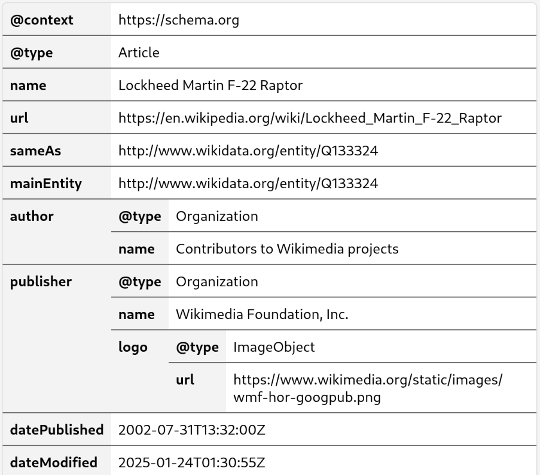

webapplet-json
==============

A simple JSON viewer [web applet](https://github.com/unternet-co/web-applets).

 * Tree-like view of JSON object.
 * Light-/Dark-mode color scheme.
 * Mouse hover coloring

Screenshot
----------

